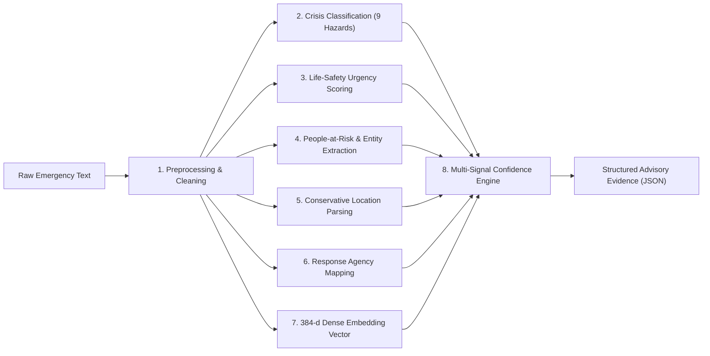
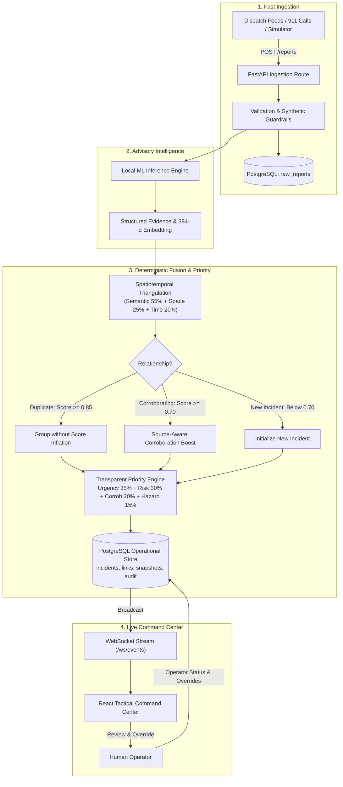

# ⚡ Tingle
### AI Emergency Intelligence & Continuous Incident Prioritization

[](https://www.python.org/)
[](https://fastapi.tiangolo.com/)
[](https://react.dev/)
[](https://www.typescriptlang.org/)
[](https://www.postgresql.org/)
[](https://huggingface.co/sentence-transformers/all-MiniLM-L6-v2)
[](https://bitnbuild.com/)

**Tingle** is a human-in-the-loop emergency decision-support system. It transforms incoming streams of noisy, fragmented, and duplicate emergency calls into structured, continuously prioritized incidents on a live operator dashboard.

---

## 📌 The Problem

During natural disasters and urban crises, 911 dispatch centers and emergency operations are inundated with incoming communication:

* **Duplicate floods:** Dozens of panicked callers report the exact same flooded underpass within minutes, tying up critical phone lines.
* **Incomplete locations:** Callers rarely give GPS coordinates—they say *"water is rising behind the market near the railway bridge"*.
* **Conflicting details:** Initial reports frequently underestimate or exaggerate hazard severity, casualties, and water velocity.
* **Distractor traffic:** Routine municipal complaints, road closures, and social media rumors arrive mixed in with life-threatening emergencies.

Classifying whether a single text message mentions a "flood" is a solved baseline problem. The real bottleneck is **continuous incident fusion**: grouping fragmented reports over time, recognizing when a dispatch corroborates an active incident versus repeating an existing caller, calculating an explainable operational priority, and putting human dispatchers in complete control.

---

## 🧠 The Machine Learning Pipeline (In-Depth)

In Tingle, **machine learning is advisory**. The AI extracts structured signals from messy text, but deterministic system logic owns incident state, priority rankings, and database records. This design prevents language models from hallucinating operational decisions.

The entire ML pipeline runs **locally in-process** on standard CPU hardware with zero external API calls, completing inferences in ~23 milliseconds.



### 1. Text Preprocessing & Normalization
Incoming dispatches arrive from SMS, web forms, and voice-to-text transcriptions filled with typos, contractions, and frantic fragments. The preprocessor cleans punctuation, normalizes spacing, and standardizes vocabulary without stripping critical situational keywords.

### 2. Multi-Hazard Crisis Classification
Tingle categorizes incoming dispatches into 9 canonical disaster hazard categories:
* **Floods & Flash Floods**
* **Fire, Wildfire & Explosion**
* **Structural Collapse**
* **Earthquake & Landslide**
* **Civil Unrest & Active Threats**
* **Medical Emergencies**
* **Severe Storms & Weather**
* **Utility & Infrastructure Failures**
* **General / Other Incidents**

Each category is assigned a calibrated severity baseline used downstream in triage priority calculations.

### 3. Life-Safety Urgency Estimation
Urgency isn't just a label—it measures immediate threat to life:
* **CRITICAL:** Imminent life threat (e.g., people trapped inside submerged vehicles or collapsing structures).
* **HIGH:** Rapidly escalating hazard with potential casualties or blocked evacuation routes.
* **MEDIUM:** Significant structural damage or utility hazard without direct casualties.
* **LOW:** Informational advisories, minor property disruption, or post-incident reports.

The urgency engine inspects linguistic indicators of velocity, entrapment, rising water, and fire spread to assign discrete urgency ratings and confidence scores.

### 4. People-at-Risk & Casualty Profiling
The entity extraction module detects numbers of affected individuals, injured persons, and trapped victims. If a dispatch states *"4 people stuck on the roof with 2 children"*, the extractor isolates the casualty count (4) and flags active entrapment, directly increasing the incident's life-safety weight.

### 5. Conservative Location Handling (Zero Hallucination)
A critical rule in emergency intelligence: **never fabricate GPS coordinates**. If a caller reports *"near the underpass behind the mall"*, traditional generative models often hallucinate coordinates. Tingle extracts the landmark phrasing verbatim, tags its precision as approximate or unknown, and preserves caller-provided coordinates only when explicitly verified. In evaluation, Tingle achieved a **0.00% coordinate hallucination rate**.

### 6. Tactical Response Mapping
Emergency dispatchers must know which agencies to notify instantly. The response engine maps extracted incident features to required emergency branches:
* **Search & Rescue (SAR)**
* **Emergency Medical Services (EMS)**
* **Fire & Rescue**
* **Law Enforcement**
* **Utility & Public Works**

### 7. Dense Semantic Embeddings (`all-MiniLM-L6-v2`)
To connect reports written in different words, Tingle generates 384-dimensional dense vector embeddings using the open-source `sentence-transformers/all-MiniLM-L6-v2` model. This allows the system to recognize that *"water rising over the hood of my car"* and *"vehicle submerged up to windows near underpass"* refer to the same crisis.

### 8. Multi-Component Confidence Scoring
Every extracted field receives a calibrated confidence score. If overall model confidence falls below 50%, a low-confidence flag is attached and the priority score applies a conservative safety adjustment (-10 points) until a human dispatcher reviews the incident.

---

## 🔄 How Tingle Works (End-to-End Flow)



### Triangulation & Smart Corroboration
When a report arrives, Tingle compares it against active incidents within a 6-hour lookback window using three dimensions:
* **Semantic Similarity (55%):** Cosine similarity between embedding vectors.
* **Spatial Proximity (25%):** Haversine distance within a 2.5 km cluster radius.
* **Temporal Proximity (20%):** Exponential decay with a 3-hour half-life.

**Source-Aware Corroboration:** Five phone calls from five distinct callers corroborate an incident and raise its priority. Five calls from the *same* phone number or radio ID are recognized as duplicates and grouped together without artificially inflating the priority score.

### Explainable Priority Formula
Every incident receives a clear, deterministic score from **0.0 to 100.0**:

$$\text{Priority} = (0.35 \times \text{Urgency}) + (0.30 \times \text{Casualties}) + (0.20 \times \text{Corroboration}) + (0.15 \times \text{Hazard}) + \text{Modifiers}$$

* **CRITICAL ($\ge 80$):** Immediate multi-casualty life-safety response required.
* **HIGH ($\ge 60$):** Escalating severe hazard.
* **MEDIUM ($\ge 35$):** Active disruption requiring response.
* **LOW ($< 35$):** Monitored minor incident.
* **Modifiers:** Human verification (+10), human escalation (+15), low-confidence penalty (-10), and resolution (forces score to 0.0).

---

## 🖥️ Tactical Command Center Features

* **Live Incident Queue:** Priority-sorted queue updated instantly over WebSockets.
* **Tactical Leaflet Map:** Dark-mode geospatial map displaying active incidents color-coded by priority tier.
* **Deep Fact & Evidence Inspector:** Inspect aggregated incident details, casualty estimates, required services, and every linked caller dispatch.
* **Human-in-the-Loop Controls:** One-click status transitions (ACTIVE $\to$ VERIFIED $\to$ ESCALATED $\to$ RESOLVED).
* **Manual Field Overrides:** Operators can correct any AI-extracted field with mandatory justification logging for accountability.
* **Audit Trail & Timelines:** Full historical audit record tracking every system calculation and human override.

---

## 🚀 Quickstart & Deployment

Run Tingle locally in under two minutes:

### 1. Clone & Configure Environment
```bash
cp .env.example .env
# Ensure DATABASE_URL points to your PostgreSQL instance in .env
```

### 2. Backend Setup
```bash
# Create & activate environment
python -m venv .venv
source .venv/bin/activate   # On Windows: .venv\Scripts\Activate.ps1

# Install & initialize database
pip install -r backend/requirements.txt
python backend/scripts/init_db.py

# Launch FastAPI server (port 8000)
uvicorn backend.app.main:app --port 8000 --reload
```

### 3. Frontend Setup
```bash
# In a separate terminal
cd frontend
npm install
npm run dev
```
Open **`http://localhost:5173`** to access the tactical command center.

### 4. Run the Disaster Simulator Demo
Stream realistic flood crisis dispatches directly into your live dashboard:
```bash
python -m simulator.cli --scenario flood_rasulgarh --live --endpoint http://localhost:8000/reports --speed 2x --rebase-time-now
```

> **Need a lightweight run?** Set `ML_LIGHTWEIGHT_MODE=true` in `.env` to run on memory-constrained servers (e.g. 512MB RAM cloud containers) using fast lexical heuristics instead of dense embeddings.

---

## 📊 Verified System Results

Metrics audited from the final evaluation suite ([`evaluation/FINAL_SCORECARD.md`](evaluation/FINAL_SCORECARD.md)):

| Subsystem | Metric | Result | Operational Meaning |
| :--- | :--- | :---: | :--- |
| **Direct ML** | Schema Coverage | **100.00%** | Full JSON output adherence across 27/27 test dispatches |
| **Direct ML** | High Urgency Recall | **87.50%** | 7 of 8 life-threatening emergencies identified |
| **Direct ML** | Hard Negative Rejection | **100.00%** | Non-crisis dispatches rejected from emergency priority |
| **Direct ML** | Coordinate Hallucination | **0.00%** | Zero fabricated GPS coordinates |
| **Direct ML** | Warm Inference Latency | **23.42 ms** | In-process local CPU execution time (p50) |
| **Live E2E** | HTTP Ingestion Reliability | **100.00%** | 27/27 dispatches ingested with HTTP 201 Created |
| **Live E2E** | Pairwise Clustering F1 | **0.8478** | Report-to-incident clustering accuracy (Rand index: 0.9202) |
| **Live E2E** | Critical Triage Recall | **100.00%** | Life-safety disaster correctly escalated to 85.35 (CRITICAL) |
| **Resilience** | Surge Throughput | **19.55 rps** | 40/40 healthy surge requests processed (p50: 51.75 ms) |
| **Resilience** | Backend Outage Recovery | **100.00%** | Zero lost reports; FIFO queue buffered and flushed all reports |

---

## 🛠️ Technology Stack

| Layer | Tools |
| :--- | :--- |
| **Backend & API** | Python 3.13 / 3.14, FastAPI 0.115+, Uvicorn, Pydantic v2 |
| **Database & ORM** | PostgreSQL 15+, SQLAlchemy 2.0, Psycopg 3.2 (7 core tables) |
| **Machine Learning** | `sentence-transformers`, `all-MiniLM-L6-v2` (384 dims), NumPy |
| **Frontend UI** | React 18.3, TypeScript 5.7, Vite 8, Lucide React |
| **Tactical Map** | Leaflet 1.9, OpenStreetMap |
| **Realtime** | Native WebSockets (`/ws/events`), Python `websockets` |
| **Simulation Client** | HTTPX, Custom `SafeHttpTransport` (Circuit Breaker & FIFO buffer) |
| **Testing** | pytest 8.3+, scikit-learn metrics, JSONSchema |

---

## 👥 Team

Built for the **Bit n Build Hackathon 2026** (24-Hour Sprint):

* **Aryan Bagchi:** ML Architecture, NLP Pipeline, Semantic Embeddings, Urgency Engine
* **Daksh Madaan:** Backend REST API, PostgreSQL Architecture, Incident Fusion & Priority Engine
* **Sri Sai Srinivash Panda:** Command Center UX, Leaflet Geospatial Map, Operator Review & Override UI
* **Pankaj Sharma:** Simulator Engine, Fault Injection, System Resilience, Master Scorecard
